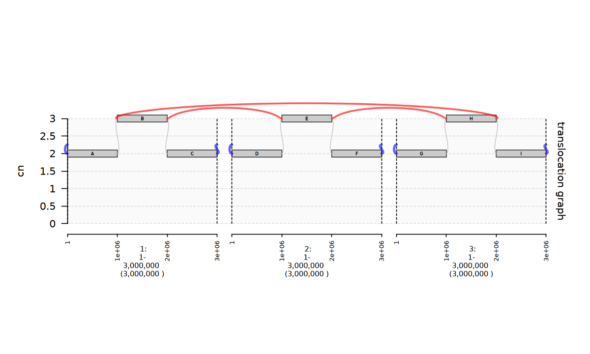
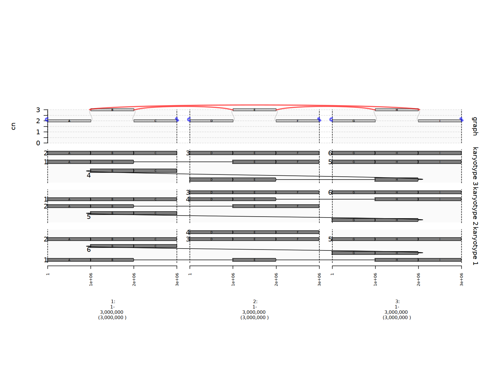
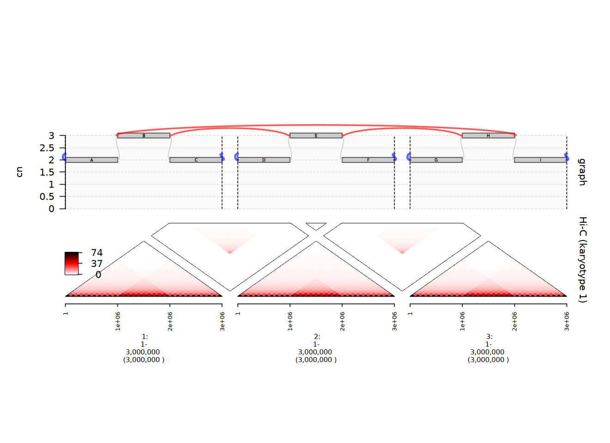
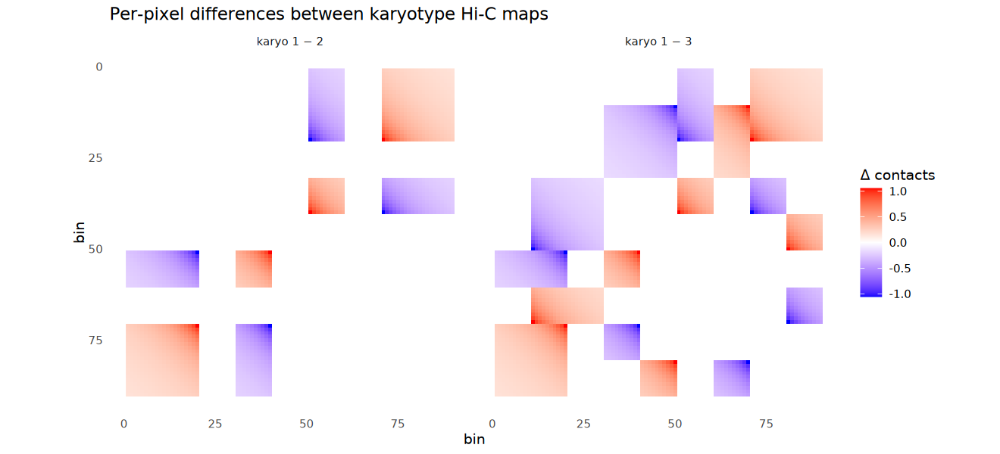
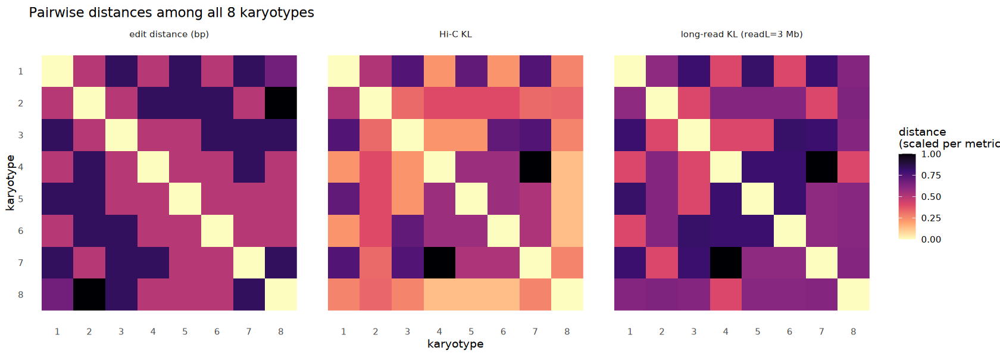
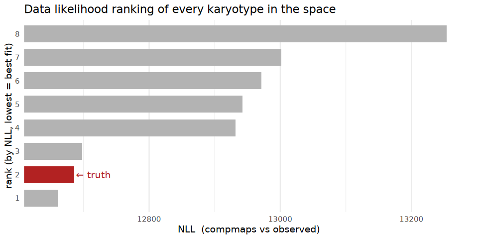
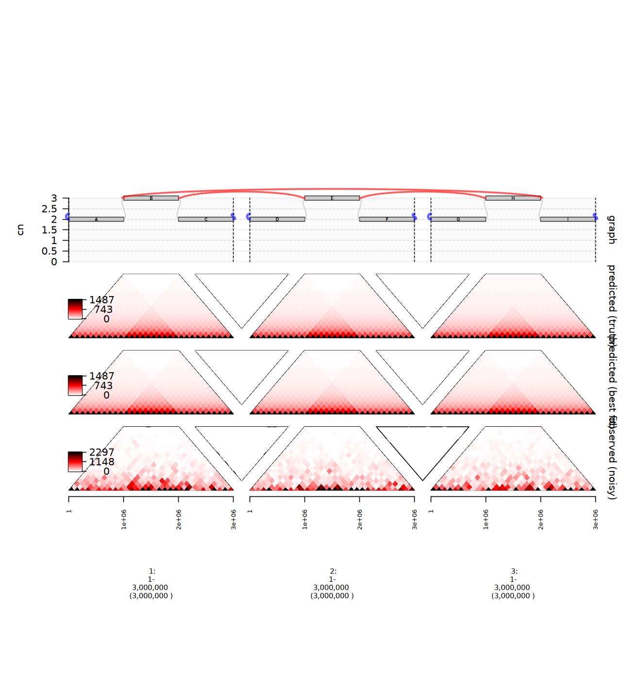

```
  __          _   _   __
 / _|        | | | | / /
| |_ __ _ ___| |_| |/ /  __ _ _ __
|  _/ _` / __| __|    \ / _` | '__|
| || (_| \__ \ |_| |\  \ (_| | |
|_| \__,_|___/\__\_| \_/\__,_|_|
```

Simulate Hi-C data for any rearranged karyotype — fast.

`fastKar` is an R package for sampling and analysing **karyotype walks** through
structurally rearranged cancer genomes, plus forward-modeling Hi-C and long-read
data from those karyotypes. It builds on the [gGnome](https://github.com/mskilab-org/gGnome)
framework.

The 3D model is parameterised from the high-depth Hi-C library published by
[Rao et al. (2014)](https://pubmed.ncbi.nlm.nih.gov/25497547/).

---

## Tutorial — the 5-step arc

The full walkthrough lives in [`fastKar.ipynb`](fastKar.ipynb). What follows is
the headline version, anchored on a synthetic **three-way reciprocal
translocation** between chromosomes 1, 2, and 3.

### 1 · Build a graph

```r
library(fastKar)
gw <- make_threeway_repdup(regsize = 1e6)
gg <- gw$graph
gg
#> gGraph with 9 nodes, 6 loose ends, and 12 edges (6 REF and 6 ALT)
```

Each of chromosomes 1, 2, 3 is tiled into segments `{A,B,C}`, `{D,E,F}`,
`{G,H,I}`. Three reciprocal translocations form a directed cycle
`B → E → H → B`, producing three derivative chromosomes alongside the three
normal ones.



Middle segments (B, E, H) sit at CN = 3; outer segments at CN = 2; six loose
ends mark the chromosomal termini.

---

### 2 · Sample karyotypes

```r
walks_gw <- sample.gwalks(gg, N = 500, return.gw = TRUE,
                          remove.dups = TRUE, verbose = FALSE)
length(walks_gw)
#> [1] 8
```

The full karyotype space is enumerable here: 13,824 raw wirings collapse to
8 unique karyotypes after canonical-hashing under cyclic, RC, and multiset
symmetries. Each karyotype is a set of 6 walks covering all 21 node-copies.



Most karyotypes produce six linear chromosomes (three normal + three
derivatives); one of the eight closes the `B → E → H → B` cycle into a small
circular walk.

---

### 3 · Forward-simulate Hi-C

```r
sim <- forward_simulate(walks_gw[[1]], pix.size = 1e5, depth = 1, model = 0)
```

`forward_simulate` predicts Hi-C contacts under the assumption that contact
frequency scales with **linear distance along the karyotype walk**, not along
the reference. Junctions that bring distant reference positions into adjacency
on the walk produce strong off-diagonal Hi-C signal.



Different karyotypes look superficially similar — same CN, same intra-chromosome
diagonals — because the karyotype-discriminating signal lives in
**interchromosomal contacts**:



Per-pixel difference maps for `karyo 1 − 2` and `karyo 1 − 3` show that
intra-chromosomal blocks carry zero `Δ`; the differences are entirely between
chromosomes, exactly where the translocation junctions route contacts.

---

### 4 · Walk-to-walk distances

```r
d <- get_dists(walks_gw, graph = gg,
               pix.size = 1e5, readL = 3e6, edit_thresh = 0)
# returns a data.table of pairwise (edit, hic, longread) distances
```

Three metrics quantify "closeness" between karyotypes:

| function           | distance                                  | what it measures                                            |
|--------------------|-------------------------------------------|-------------------------------------------------------------|
| `edit_dist_cpp`    | walk-set edit distance (bp)               | Hungarian assignment over Needleman-Wunsch alignment costs  |
| `hic_kl`           | Hi-C KL                                   | NB divergence between simulated Hi-C maps                   |
| `longread_kl`      | long-read KL                              | KL between pseudo-read distributions at a given read length |



For this graph the three metrics largely agree on the qualitative ordering;
edit distance picks up segment-by-segment differences in walk structure, while
Hi-C KL picks up quantitative differences in interchromosomal contact patterns.

---

### 5 · Fit karyotypes against observed Hi-C

```r
# Treat one karyotype as ground truth, simulate noisy observation
true_walk <- walks_gw[[1]]
true_hic  <- forward_simulate(true_walk, pix.size = 1e5, depth = 20)
obs_hic   <- make_noisymap(true_hic, theta = 2)[[1]]

# Search candidate karyotypes against the observation
fit <- bestfit_search(gg, hic = obs_hic, nsample = 50,
                      depth = 20, pix.size = 1e5, topk = 5)
```

`bestfit_search` samples candidate karyotypes, forward-simulates Hi-C for each,
and ranks by negative-binomial NLL via `compmaps` against the observation.



The data confidently localizes truth into the top tier of the 8-karyotype
space; depending on the noise realization, truth lands at rank 1 or 2, with a
large NLL gap to the bottom half. The rank-1 fit's predicted Hi-C is nearly
indistinguishable from the ground-truth's:



For simple and long-range SV events (e.g. multi-way translocations) the karyotype space is small
and Hi-C is sufficient to localize truth tightly. For more complex and local alterations
that duplicate segments (e.g. BFB amplicons, ecDNA) the karyotype space will be exponentially larger and
`bestfit_search` may be becomes a localiser over a wider neighborhood of similar
karyotypes rather than a point estimator — the same pipeline scales to both regimes.

---

## Where to go next

* `R/graphstats.R` — sampling (`sample.gwalks`), karyotype hashing, walk-to-walk distances
* `R/forward.R` — forward simulation (`forward_simulate`)
* `R/comparisons.R` — likelihood and noise (`compmaps`, `make_noisymap`, `callloops`)
* `R/backwards.R` — fitting against observed Hi-C (`bestfit_search`)
* `R/tests.R` — synthetic graph constructors (`make_threeway_repdup`, `gimme_bfb`, `makerepdup`)
* `tests/testthat/` — regression and correctness tests
* `bench/` — benchmark harness and history (drop real `gGraph` `.rds` files in `bench/graphs/`)
